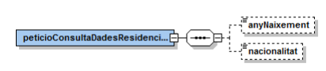
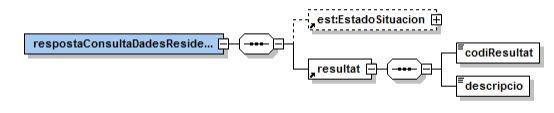
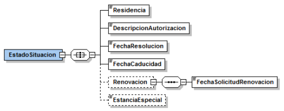

# Via Oberta – Estrangeria
Documentació d'integració del servei Estrangeria del Consorci AOC.

# **Índex** #

1. [Introducció](#1)
2. [Transmissions de dades disponibles](#2)
3. [Missatgeria del servei](#3)
   1. [Verificació de les dades de residència legal (RESIDENCIA_LEGAL)](#3.1)
      1. [Petició – dades genèriques](#3.1.1)
      2. [Petició – dades específiques](#3.1.2)
      3. [Resposta – dades específiques](#3.1.3)

## 1 Introducció <a name="1"></a>

Aquest document detalla la missatgeria associada al servei d’obtenció de les dades de residència
legal del Ministerio de Interior.

Per a poder realitzar la integració cal conèixer prèviament la següent documentació:

- Document de Missatgeria Genèrica de la PCI del Consorci AOC.

## 2 Transmissions de dades disponibles <a name="2"></a>

Les dades disponibles a través del servei són les que es presenten a continuació:

- **EMISSOR**: Ministerio de Interior 

| **PRODUCTE** | **MODALITAT** | **DESCRIPCIO** |
| --- | --- | --- |
| **ESTRANGERIA** | RESIDENCIA_LEGAL  | Consulta de les dades de residència legal.

La consulta del producte té disponible la versió imprimible del resultat de la consulta en format PDF.
Per més detalls adreceu-vos a l’apartat Extensions de missatgeria del document de missatgeria
genèrica. 

## 3 Missatgeria dels serveis <a name="3"></a>

L’emissor de les dades requereix que s’informin les dades del funcionari que realitza la consulta.
Així, cal informar els següents camps de l’element Funcionario del bloc de dades genèriques:

```
/Peticion/Funcionario/NombreCompletoFuncionario,
/Peticion/Funcionario/NifFuncionario,
//SolicitudTransmision/DatosGenericos/Solicitante/Funcionario/NombreCompletoFuncionario i
//SolicitudTransmision/DatosGenericos/Solicitante/Funcionario/NifFuncionario
```
### 3.1 Verificació de les dades de residència legal (RESIDENCIA_LEGAL) <a name="3.1"></a>

#### 3.1.1 Petició – dades genèriques <a name="3.1.1"></a>

| _Element_ | _Descripció_ |
| --- | --- |
//DatosGenericos/Titular/TipoDocumentacion | Tipus de documentació (NIE ).
//DatosGenericos/Titular/Documentacion | Documentació.

#### 3.1.2 Petició – dades específiques <a name="3.1.2"></a>

<p align="center">

</p>

| _Element_ | _Descripció_ |
| --- | --- |
peticioConsultaDadesResidenciaLegal/dataNaixement | Any de naixement del titular (format AAAA).
peticioConsultaDadesResidenciaLegal/nacionalitat | Nacionalitat del titular (codificació ISO 3166-1 Alpha 3). 

#### 3.1.3 Resposta – dades específiques <a name="3.1.3"></a>

<p align="center">

</p>

| _Element_ | _Descripció_ |
| --- | --- |
respostaVerificacioDadesResidencia/EstadoSituacion | Bloc de dades corresponent a la informació sobreles dades de residencia legal del titular.
respostaVerificacioDadesResidencia/resultat/codiResultat | Codi de resultat:<ul><li>0000 : existeix autorització de residència o estància.</li><li>0001 : no existeix autorització de residència o estància.</li><li>0002 : ciutadà nacionalitzat espanyol.</li><li>0003 : no s’ha localitzat cap ciutadà amb la documentació aportada.</li><li>0004 : existeix més d’un estranger amb les dades proporcionades. Cal informar més a la consulta per a distingir-los.</li><li>0502 : error realitzant la consulta.</li></ul>
respostaVerificacioDadesResidencia/resultat/descripcio | Descripció del resultat.

3.1.3.1 EstadoSituacion

| _Element_ | _Descripció_ |
| --- | --- |
//EstadoSituacion/Residencia | Tipus d’autorització de residència: <ul><li>0 : Sense permís.</li><li>1 : Comunitari.</li><li>2 : Familiar de comunitari.</li><li>3 : Extracomunitari.</li></ul></br>Pot donar-se el cas que el codi de residència sigui 0 i el codi de resultat sigui 0000. Aquest cas indica que el ciutadà disposa de permís d’estància però no de residència.
//EstadoSituacion/DescripcionAutorizacion | Descripció literal del tipus d’autorització de la residència.
//EstadoSituacion/FechaResolucion | Data de resolució del tràmit de residència (format DD/MM/AAAA ).
//EstadoSituacion/FechaCaducidad | Data de caducitat de la residència legal (format DD/MM/AAAA ).
//EstadoSituacion/Renovacion</br>/FechaSolicitudRenovacion | Data de la sol·licitud de renovació de la residència legal.</br>En cas de que l’autorització hagi caducat, el camp vindrà informat només en el cas que el titular hagi presentat una sol·licitud de renovació.</br>Durant el tràmit de renovació, s’estén la vigència anterior.
//EstadoSituacion/EstanciaEspecial | Indicador de si té permís d’Estància Especial segons Art 37 RD 557/2011: <ul><li>1 : Estudis.</li><li>2 : Investigació o formació.</li><li>3 : Mobilitat alumnes.</li><li>4 : Pràctiques no laborables.</li><li>5 : Serveis de voluntariat.</li><li>6 : Estudis MIR.</li><li>7 : Altres estàncies.</li><li>8 : Estudis / intercanvi.</li><li>10 : Estudis familiar.</li><li>11 : Investigació o formació familiar.</li><li>12 : Mobilitat d’alumnes familiar.</li><li>13 : Pràctiques no laborables familiar.</li><li>14 : Serveis de voluntariat familiar.</li></ul>

<p align="center">

</p>